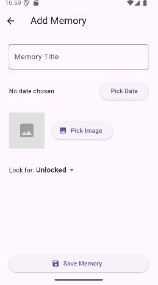
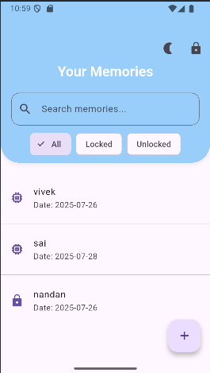
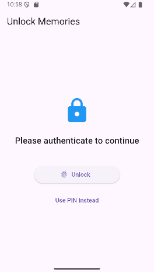

# TimeLock Apps

A secure, beautiful Flutter application to store, lock, and manage your memories—protected with biometrics or PIN!

---

## ✨ Features

- Biometric/PIN authentication
- Add/edit/delete memories with title, date, and optional photo
- Lock individual memories for N days (timed unlock)
- Fully searchable by title
- Custom dark/light mode toggle
- Share memories and images
- Animated, smooth UI and auto-lock on background
- Privacy-first: all data stored securely on device

## 🚀 Getting Started

1. **Clone this repo**  
   **(https://github.com/sampath970/imagelocker_application)**

2. **Install dependencies**  

3. **Run the app**  

---

## 📱 Screenshots

<!--  -->
<!--  -->
<!--  -->

---

## ⚡ Build for Release

- **Android APK:**  
- The built APK will be at: `build/app/outputs/flutter-apk/app-release.apk`

- *(iOS users: build on a Mac with Xcode and sign with a developer account)*

---

## 🛡️ Permissions

- **Biometrics (local_auth)** – for device authentication
- **Storage/Photos (image_picker)** – for adding images to memories
- *(No data is uploaded or leaves your phone!)*

---

## 🌟 Customization

- **Icon:**  
  Custom launcher icon in `assets/icon.png`
- **App Name:**  
  Change in `android/app/src/main/res/values/strings.xml`  
  (and, optionally, in `ios/Runner/Info.plist`)

---

## 👨‍💻 Credits

- Developed by: **Sugali Sampath Kumar Naik**  
- Contact: **sampathkumarnaiksugali1@gmail.com**   
- Inspired by privacy-focused memory/journaling apps

---

---

## 📣 Issues and Contributions

Feedback and pull requests welcome!  
For issues, use the GitHub "Issues" section or contact the developer.

---

> Built with Flutter ❤️
